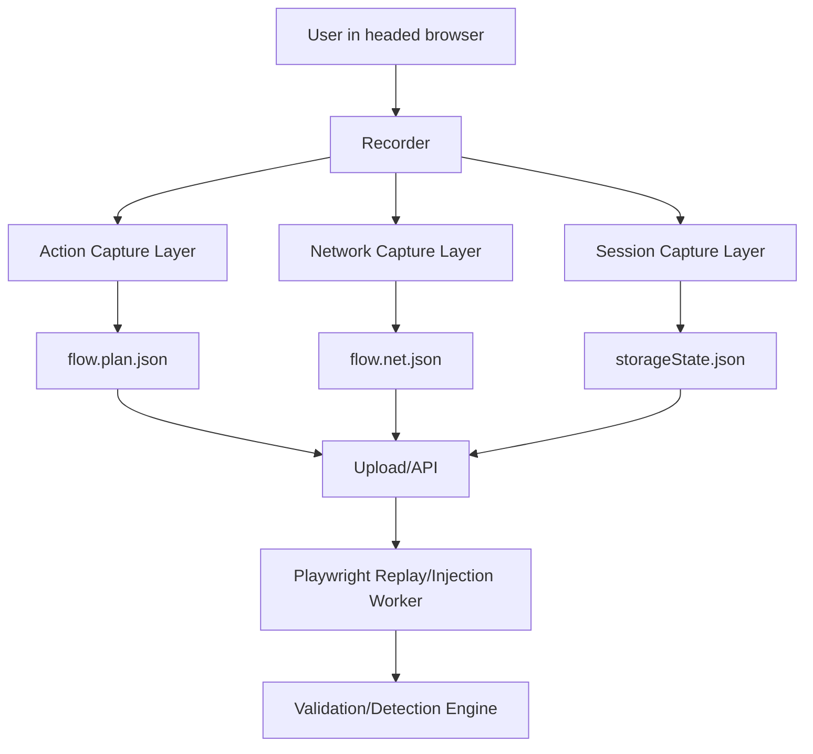

## Module Overview

The Recorder Architecture and Capture Scope module defines how user interactions are captured, normalized, and exported for later deterministic replay and security testing. In MVP scope, the recorder is a **headed Playwright tool in Node.js** that emits three artifacts:

- `storageState.json` — authenticated browser/session state
- `flow.plan.json` — ordered user actions
- `flow.net.json` — captured network activity

Recorder v0 intentionally captures only the smallest useful action set:

- `click`
- `fill`
- `select`
- `navigation`

For `fill`, only the **final value on blur/change** is recorded, not every keystroke. This keeps recordings compact, lowers privacy exposure, and improves downstream action→request correlation.

## Architecture

### Component Architecture

The recorder sits at the front of the broader record/replay/inject pipeline. Its responsibility is to **observe and serialize**, not to execute attacks. Replay, payload injection, and exploit validation belong to backend Playwright workers.



### Key Interactions

- Action capture records atomic UI events with timestamps, selectors, and frame context.
- Network capture records request/response metadata in a compact HAR++-style log.
- Session capture saves cookies/local storage state via Playwright `storageState`.
- Correlation links requests to actions using timestamp windows.

## Implementation Details

### Technical Approach

Recorder v0 uses a minimal event model:

| Action | Capture rule | Stored fields |
|--------|--------------|---------------|
| Click | DOM click on actionable element | selector, timestamp, frame, state |
| Fill | `blur`/`change` on input/textarea | selector, final value, timestamp |
| Select | `change` on `<select>` | selector, selected value(s), timestamp |
| Navigation | full load or SPA route change | URL, timestamp |

Selectors should include **primary + fallback locators**, preferring stable attributes such as `data-testid`, ARIA labels, or role-based targeting, with CSS fallback.

### Example Event Capture

```javascript
document.addEventListener('click', event => {
  const el = event.target;
  const selector = getUniqueSelector(el);
  chrome.runtime.sendMessage({
    type: 'click',
    selector,
    timestamp: Date.now()
  });
});
```

```javascript
document.addEventListener('blur', event => {
  const el = event.target;
  if (el.tagName === 'INPUT' || el.tagName === 'TEXTAREA') {
    const selector = getUniqueSelector(el);
    chrome.runtime.sendMessage({
      type: 'fill',
      selector,
      value: el.value,
      timestamp: Date.now()
    });
  }
}, true);
```

```javascript
(function() {
  const pushState = history.pushState;
  history.pushState = function(...args) {
    pushState.apply(this, args);
    chrome.runtime.sendMessage({
      type: 'navigation',
      url: location.href,
      timestamp: Date.now()
    });
  };
})();
```

### Correlation Algorithm

Requests are mapped to actions using **per-action time windows**:

- each action gets `actionId` and `startTs`
- when the next action begins, the previous action closes with `endTs = nextAction.startTs - 1`
- requests are assigned to the action whose window contains the request timestamp
- navigations are represented as explicit actions

## Related Decisions

This module is driven by these decisions:

- **MVP recorder: headed Playwright (Node.js) emitting three artifacts**  
  Chosen for fidelity and alignment with replay workers.
- **Recorder v0 captures only click/fill/select/navigation**  
  Chosen to minimize noise while preserving security-relevant behavior.
- **Action→request correlation via per-action time windows**  
  Chosen as the simplest deterministic MVP mapping strategy.
- **Engine-first MVP; no full UI yet**  
  Keeps focus on reliable artifacts and replay correctness before product UX.

## Key Technical Details

### Data Structures

- `flow.plan.json`: ordered list of actions with `actionId`, `type`, `locator`, `value`, `frame`, `startTs`, `endTs`
- `flow.net.json`: request/response events with `url`, `method`, `headers`, `postData` (optional/truncated), `status`, `contentType`, timestamps, and optional `reqSignature`
- `storageState.json`: Playwright session state

### Integration Points

- Playwright browser/context APIs
- DOM event listeners for action capture
- optional extension-based capture later for improved UX
- backend upload endpoint for artifact ingestion

### Dependencies

- Node.js / TypeScript
- Playwright
- JSON schema validation for artifact contracts