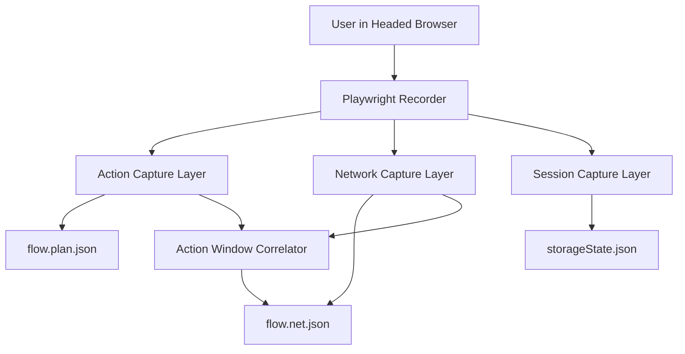
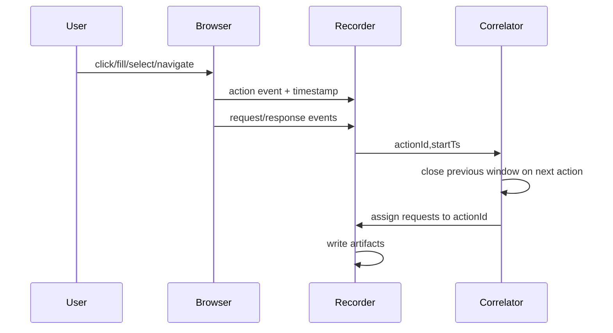

## Module Overview

The **Recorder Architecture and Interaction Capture** module defines how the MVP recorder observes a real user session and emits the minimal artifacts needed for deterministic replay, payload injection, and exploit validation.

Scope for Recorder v0 is intentionally narrow:

- Run as a **headed Playwright recorder in Node.js**
- Capture only four action types:
  - `click`
  - `fill`
  - `select`
  - `navigation`
- Persist three artifacts:
  - `storageState.json`
  - `flow.plan.json`
  - `flow.net.json`

This module is focused on **security-relevant interaction capture**, not full UX telemetry. It ignores low-value noise such as scrolling, hover, and animation state.

## Architecture

### Component Architecture

The recorder consists of three main capture layers:

- **Browser/session capture**
  - Stores authenticated browser state via Playwright `storageState`
- **UI action capture**
  - Records a timeline of user interactions with selectors, values, timestamps, and frame context
- **Network capture**
  - Records requests/responses and correlates them to actions using timestamp windows

### Key Interactions

- User performs actions in a headed browser
- Recorder assigns each action an `actionId` and `startTs`
- Network events are collected during the session
- When the next action starts, the previous action window closes
- Requests whose timestamps fall inside that window are attached to the prior action



### Flow Sequence



## Implementation Details

### Technical Approach

Recorder v0 captures only actions that:

- change input
- trigger network
- change application state

For fills, capture the **final value on blur/change**, not every keystroke. For each action, store:

- `actionId`
- `type`
- `ts`
- selector set:
  - primary locator
  - fallback locator(s)
- `frame` context
- optional `value` for `fill`/`select`
- `url` for `navigation`

### Example Action Records

```json
{
  "actionId": "a1",
  "type": "click",
  "ts": 1710840000000,
  "selector": {
    "primary": { "kind": "testId", "value": "login-btn" }
  }
}
```

```json
{
  "actionId": "a2",
  "type": "fill",
  "ts": 1710840000500,
  "selector": {
    "primary": { "kind": "ariaLabel", "value": "Email" }
  },
  "value": "user@example.com"
}
```

```json
{
  "actionId": "a4",
  "type": "navigation",
  "ts": 1710840002000,
  "url": "https://example.com/dashboard"
}
```

### Artifact Contract

| Artifact | Purpose |
|----------|---------|
| `storageState.json` | Auth/session state for replay |
| `flow.plan.json` | Ordered action timeline and locators |
| `flow.net.json` | HAR++-style network log with action mapping |

## Related Decisions

This design follows these decisions:

- **MVP recorder as headed Playwright (Node.js)**  
  Chosen for fidelity, session capture, and alignment with replay workers.
- **Recorder v0 captures only click/fill/select/navigation**  
  Reduces noise while preserving the core attack surface.
- **Action→request correlation via time windows**  
  Simple and deterministic for MVP: `startTs` opens a window, next action closes it.
- **Node.js/TypeScript aligned with Playwright**  
  Enables shared types and simpler integration across recorder and execution.

## Key Technical Details

### Algorithms and Data Structures

- **Action timeline**
  - append-only ordered list of actions
- **Correlation model**
  - each action has:
    - `actionId`
    - `startTs`
    - computed `endTs`
- **Request assignment**
  - assign request to action where `startTs <= reqTs <= endTs`

### Integration Points

- Playwright browser/context/page events
- Downstream replay/injection engine consumes:
  - `storageState.json`
  - `flow.plan.json`
  - `flow.net.json`

### Dependencies

- **Node.js**
- **Playwright**
- JSON schemas for action and network artifact validation

This module provides the recorder-side foundation for later replay, mutation, and vulnerability validation in the Playwright execution layer.