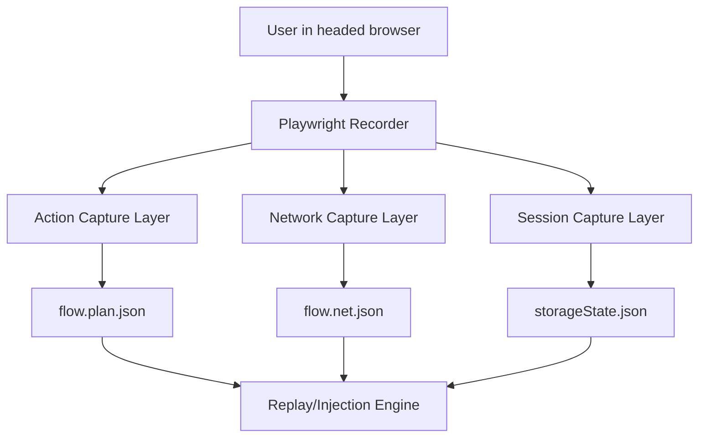
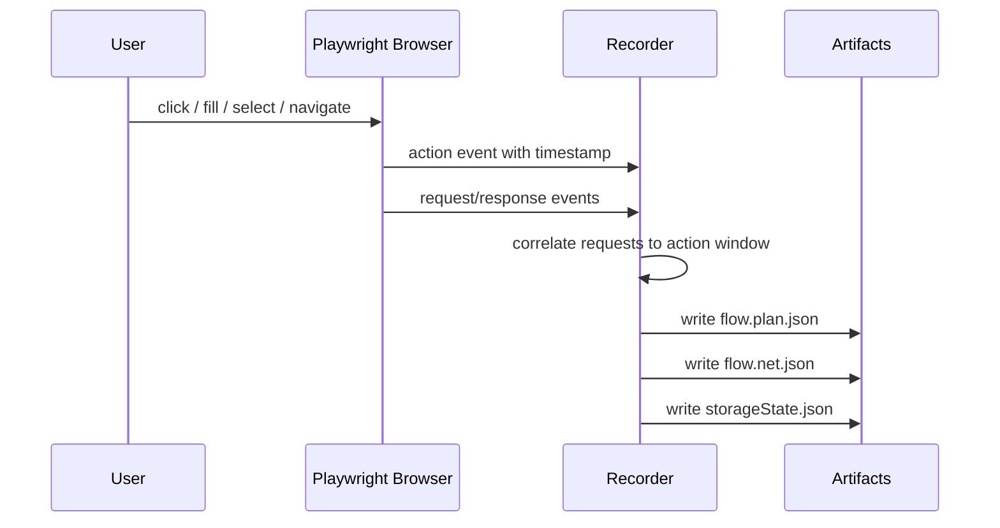

## Module Overview

The Recorder MVP captures a real user flow in a headed Playwright browser and emits the minimum artifact set required for deterministic replay and later security testing. Its scope is intentionally narrow: record only security-relevant UI actions, preserve authenticated session state, and collect a compact network log that can be correlated back to those actions.

For MVP, the recorder outputs three files:

- `storageState.json` — authenticated browser/session state
- `flow.plan.json` — ordered UI action timeline
- `flow.net.json` — compact HAR++-style network log

Supported action types are limited to:

- `click`
- `fill`
- `select`
- `navigation`

This excludes noisy events such as scroll, hover, and animation, which add complexity without improving replay or attack-surface mapping.

## Architecture

### Component Architecture

The recorder runs in Node.js with Playwright in headed mode. During recording, it observes browser interactions and network traffic, then serializes artifacts for downstream execution workers.



### Key Interactions



## Implementation Details

### Technical Approach

The recorder treats UI recording as an ordered stream of atomic actions. Each action gets:

- `actionId`
- `type`
- `ts`
- selector metadata
- optional `value`
- frame/context metadata

For `fill`, only the final value on `blur`/`change` is recorded, not every keystroke.

### Example Action Records

```json
{
  "actionId": "a1",
  "type": "click",
  "ts": 1710840000000,
  "selector": {
    "primary": { "kind": "testId", "value": "login-btn" }
  }
}
```

```json
{
  "actionId": "a2",
  "type": "fill",
  "ts": 1710840000500,
  "selector": {
    "primary": { "kind": "ariaLabel", "value": "Email" }
  },
  "value": "user@example.com"
}
```

```json
{
  "actionId": "a4",
  "type": "navigation",
  "ts": 1710840002000,
  "url": "https://example.com/dashboard"
}
```

### Artifact Shape

| Artifact | Purpose | Core Contents |
|----------|---------|---------------|
| `storageState.json` | Session reuse | cookies, localStorage/session state |
| `flow.plan.json` | Deterministic replay | ordered actions, selectors, values, frames |
| `flow.net.json` | Request analysis and targeting | requests, responses, timestamps, action linkage |

## Related Decisions

This module directly implements:

- **MVP recorder: headed Playwright (Node.js) emitting storageState + flow plan + network log** — establishes the recorder form factor and output contract.
- **Backend/agent language: Node.js (TypeScript) aligned with Playwright** — enables shared schemas and first-class Playwright integration.
- **Recorder v0 captures only click/fill/select/navigation** — constrains scope to security-relevant actions.
- **Action→request correlation via per-action time windows and timestamps** — defines how `flow.net.json` links requests to `flow.plan.json`.

The rationale is MVP speed, replay determinism, and minimal artifact complexity while still preserving useful attack-surface context.

## Key Technical Details

### Correlation Algorithm

Requests are mapped to actions using timestamp windows:

1. Start action window at `action.startTs`
2. When next action begins, close previous window with `endTs = nextAction.startTs - 1`
3. Assign each request to the action whose window contains the request timestamp
4. Treat navigation as its own action type

This is simple and sufficient for most user-driven flows.

### Data Structures

- Action record: ordered append-only list
- Network event record: request/response pair with normalized metadata
- Request signature: method + normalized URL + optional body hash

### Integration Points

- Playwright browser/page/context events
- `context.storageState()` for `storageState.json`
- downstream replay/injection engine consumes all three artifacts

### Dependencies

- Node.js
- Playwright
- Shared JSON schemas/types, preferably via TypeScript interfaces