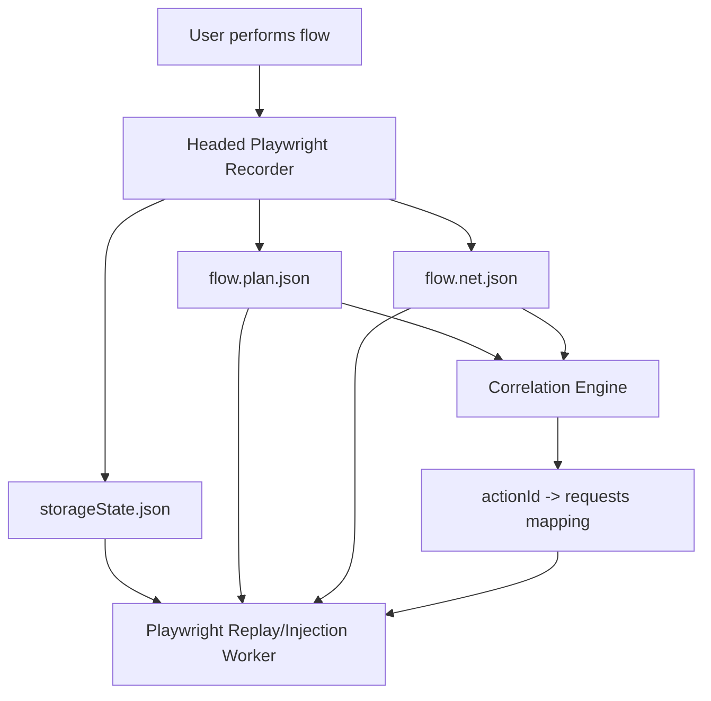

## Module Overview

The **Flow Artifact Schema and Correlation Model** defines the recorder output contract for the MVP browser-driven security engine. Its scope is limited to three artifacts:

- `storageState.json` — authenticated browser/session state
- `flow.plan.json` — ordered UI actions to replay
- `flow.net.json` — compact network log associated to those actions

This module exists to make recorded flows **deterministic, replayable, and injectable**. It focuses on a minimal action vocabulary—`click`, `fill`, `select`, and `navigation`—and a simple request attribution model based on **per-action timestamp windows**.

## Architecture

### Component Architecture

The recorder runs in headed Playwright and captures user interactions plus network activity during a manual flow. The output artifacts are then consumed by a replay/injection worker.



### Key Interactions

- The recorder captures atomic actions in order.
- Each action receives an `actionId` and `startTs`.
- Network requests are logged with timestamps and normalized signatures.
- A correlation pass assigns requests to the action window in which they occurred.

## Implementation Details

### Artifact Schemas

#### `flow.plan.json`

```json
{
  "flowId": "login-checkout-01",
  "actions": [
    {
      "actionId": "a1",
      "type": "fill",
      "startTs": 1710000001000,
      "pageUrl": "https://app.example.com/login",
      "frame": "main",
      "locator": {
        "primary": { "role": "textbox", "name": "Email" },
        "fallback": { "css": "#email" }
      },
      "value": "user@example.com"
    },
    {
      "actionId": "a2",
      "type": "click",
      "startTs": 1710000002200,
      "pageUrl": "https://app.example.com/login"
    }
  ]
}
```

#### `flow.net.json`

```json
{
  "requests": [
    {
      "requestId": "r1",
      "ts": 1710000002305,
      "method": "POST",
      "url": "https://app.example.com/api/login",
      "status": 200,
      "contentType": "application/json",
      "reqSignature": "POST /api/login body:6f1a..."
    }
  ]
}
```

### Correlation Algorithm

The MVP uses time-window attribution:

```ts
type Action = { actionId: string; startTs: number; endTs?: number };
type NetReq = { requestId: string; ts: number };

function correlate(actions: Action[], requests: NetReq[]) {
  for (let i = 0; i < actions.length; i++) {
    actions[i].endTs =
      i < actions.length - 1 ? actions[i + 1].startTs - 1 : Number.MAX_SAFE_INTEGER;
  }

  const mapping = new Map<string, string[]>();
  for (const action of actions) mapping.set(action.actionId, []);

  for (const req of requests) {
    const owner = actions.find(a => req.ts >= a.startTs && req.ts <= (a.endTs ?? 0));
    if (owner) mapping.get(owner.actionId)!.push(req.requestId);
  }

  return mapping;
}
```

Navigations are recorded as explicit actions so route changes and full-page loads remain replayable and attributable.

## Related Decisions

- **Action→request correlation via per-action time windows and timestamps**  
  Chosen for MVP simplicity, predictable implementation, and direct `actionId -> requests` mapping.

- **MVP recorder: headed Playwright (Node.js) emitting storageState + flow plan + network log**  
  Ensures the recorder format matches the later Playwright execution engine.

- **Recorder v0 captures only click/fill/select/navigation**  
  Reduces noise, avoids keystroke-level capture, and preserves the highest-value injection points.

## Key Technical Details

### Data Structures

- `actionId`: stable identifier for replay and request mapping
- `startTs` / `endTs`: correlation boundaries
- `locator`: primary plus fallback selectors
- `frame`: iframe/main-frame context
- `reqSignature`: normalized method + URL + optional body hash

### Integration Points

- **Recorder output** feeds upload/storage and replay workers
- **Replay worker** consumes all three artifacts plus correlation mapping
- **Validation/injection layer** uses `fill`/`select` values and correlated requests to target payload insertion

### Dependencies

- Node.js / TypeScript
- Playwright headed browser APIs
- Shared JSON schema/types across recorder and worker

This model is intentionally minimal: it favors deterministic replay and fast MVP delivery over perfect attribution in highly concurrent apps.