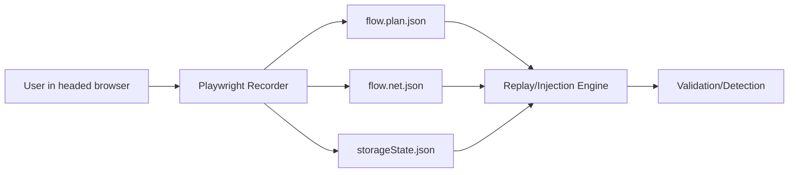
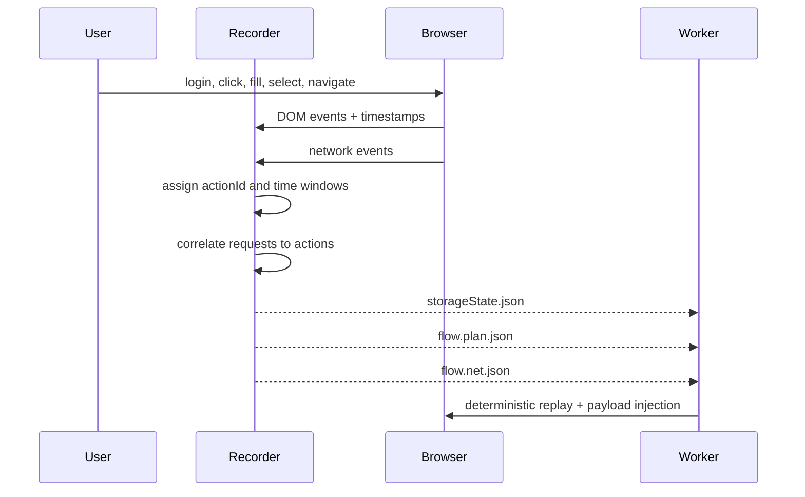

## Module Overview

The **Flow Artifact Schema and Session State** module defines the artifact contract produced by the MVP recorder and consumed by replay/injection workers. Its purpose is to persist a user-authenticated browser session plus a compact, security-focused recording of UI actions and related network activity.

For MVP, the recorder emits three files:

- `storageState.json` — Playwright session state (cookies, local/session storage where supported)
- `flow.plan.json` — ordered UI action timeline
- `flow.net.json` — compact HAR++-style network log

This module covers schema shape, field semantics, and how artifacts are linked by `actionId`. It explicitly supports deterministic per-build replay rather than generalized autonomous discovery.

## Architecture

### Component Architecture

The recorder runs in headed Playwright, captures login-first user flows, and writes artifacts for later upload or direct execution by backend workers.



### Interaction Flow



## Implementation Details

### Technical Approach

Recorder v0 captures only four action types:

- `click`
- `fill`
- `select`
- `navigation`

For `fill`, only the **final value on blur/change** is stored, reducing noise and sensitive keystroke capture. Each action includes frame context and multiple locator forms for replay resilience.

### Example Schema Fragments

```json
{
  "version": 1,
  "flowId": "login-checkout",
  "actions": [
    {
      "actionId": "a-001",
      "type": "fill",
      "startTs": 1715000001000,
      "url": "https://app.example.com/login",
      "frame": "main",
      "locator": {
        "primary": {"type": "testId", "value": "email"},
        "fallbacks": [
          {"type": "css", "value": "input[name='email']"}
        ]
      },
      "value": "user@example.com"
    }
  ]
}
```

```json
{
  "version": 1,
  "requests": [
    {
      "requestId": "r-101",
      "actionId": "a-002",
      "startTs": 1715000002200,
      "method": "POST",
      "url": "https://app.example.com/api/login",
      "status": 200,
      "contentType": "application/json",
      "reqSignature": "POST /api/login#bodyhash"
    }
  ]
}
```

### Correlation Algorithm

Requests are mapped to actions using **timestamp windows**:

- each action has `startTs`
- when the next action begins, the previous action window closes
- `endTs = nextAction.startTs - 1`
- a request belongs to the action whose window contains `request.startTs`
- navigations are recorded as explicit actions

```ts
function correlate(actions, requests) {
  for (let i = 0; i < actions.length; i++) {
    actions[i].endTs = i < actions.length - 1
      ? actions[i + 1].startTs - 1
      : Number.MAX_SAFE_INTEGER;
  }

  for (const req of requests) {
    const action = actions.find(a => req.startTs >= a.startTs && req.startTs <= a.endTs);
    req.actionId = action?.actionId ?? null;
  }
}
```

## Related Decisions

- **MVP recorder: headed Playwright emitting three artifacts**  
  This module exists because the recorder contract was intentionally minimized to `storageState.json`, `flow.plan.json`, and `flow.net.json`.

- **Recorder v0 captures only click/fill/select/navigation**  
  The schema reflects only these action types to keep artifacts small, replayable, and security-relevant.

- **Action→request correlation via per-action time windows**  
  The `actionId` linkage in `flow.net.json` is derived from this simple timestamp-based attribution model.

- **Node.js/TypeScript aligned with Playwright**  
  Shared TS types are recommended so recorder and worker consume the same artifact definitions.

## Key Technical Details

### Data Structures

- **Action record**: `actionId`, `type`, `startTs`, `url`, `frame`, `locator`, optional `value`
- **Network record**: `requestId`, `actionId`, `method`, `url`, headers, optional truncated body, `status`, `contentType`, timestamps
- **Session state**: Playwright-compatible serialized authenticated state

### Integration Points

- Producer: headed Playwright recorder
- Consumer: replay/injection workers
- Validation layer: exploit confirmation in real browser sessions

### Dependencies

- Playwright for browser automation and `storageState`
- Node.js/TypeScript for shared schema/types
- Optional upload/storage layer for artifact persistence and worker distribution