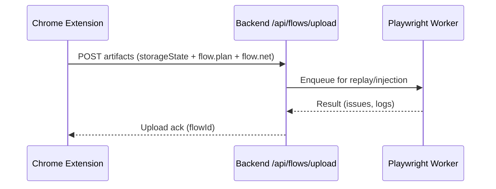

## Module Overview
This module defines the Chrome Extension Recorder used to capture user interactions (click, fill, select, navigation) and correlate them with network traffic for later deterministic replay and attack injection by a Playwright backend. Scope: lightweight, privacy-conscious recording (final input values only), multi-locator selectors, iframe support, and upload of three artifacts: storageState.json, flow.plan.json, flow.net.json.

## Architecture
### Components
- Content Script(s) — injected into pages (and iframes) to capture DOM events and selectors.
- Background Service Worker — aggregates events, persists temporary state, and performs uploads.
- Network Capture — via chrome.webRequest or chrome.debugger (DevTools) to capture request/response metadata and bodies where permitted.
- Backend Uploader (Playwright Node service) — receives artifacts and runs deterministic replay/injection.

```mermaid
graph TD
  UA[User Action (browser UI)] --> CS[Content Script]
  CS --> BG[Background Service Worker]
  CS --> NC[Network Capture (webRequest/devtools)]
  NC --> BG
  BG --> UP[Upload -> Playwright Backend]
  UP --> PW[Playwright Worker (replay/inject/validate)]
  PW --> DB[Results Storage]
```

## Implementation Details
### Action capture (v0 rules)
- Actions: click, fill, select, navigation.
- Fill: capture final value on `blur`/`change` only (no keystrokes).
- Select: capture chosen option(s).
- Navigation: detect SPA route changes (override pushState/replaceState) and full-page loads.

Code examples:

```javascript
// Click
document.addEventListener('click', event => {
  const el = event.target;
  chrome.runtime.sendMessage({
    type: 'click',
    selector: getUniqueSelector(el),
    timestamp: Date.now()
  });
});

// Fill (final value on blur)
document.addEventListener('blur', event => {
  const el = event.target;
  if (el.tagName === 'INPUT' || el.tagName === 'TEXTAREA') {
    chrome.runtime.sendMessage({
      type: 'fill',
      selector: getUniqueSelector(el),
      value: el.value,
      timestamp: Date.now()
    });
  }
}, true);

// SPA navigation (pushState)
(function() {
  const orig = history.pushState;
  history.pushState = function(...args) {
    orig.apply(this, args);
    chrome.runtime.sendMessage({ type: 'navigation', url: location.href, timestamp: Date.now() });
  };
})();
```

### Network capture
- Use `chrome.webRequest` or `chrome.debugger` to collect minimal HAR++ fields:
  - request: url, method, headers, truncated postData, startTs
  - response: status, contentType, endTs
  - compute reqSignature (method + normalized URL + optional body hash)
- Associate network events with actions using time-window correlation.

### Upload API (example)
- POST /api/flows/upload
  - body: multipart/form-data or JSON with:
    - storageState.json
    - flow.plan.json (actions: actionId, type, startTs, endTs, selectors, value, frameId)
    - flow.net.json (network events with timestamps)
- Backend responds with flowId and status.

```http
POST /api/flows/upload
Content-Type: multipart/form-data
```

Sequence diagram:



## Related Decisions
- MVP recorder: headed Playwright (Node.js) emitting storageState + flow.plan + flow.net (decision: use Playwright workers for replay).
- Recorder v0 action coverage: record click/fill/select/navigation; final fills on blur/change.
- Time-window action→request correlation: map requests to action windows (action.startTs → nextAction.startTs - 1).

These decisions drive the extension to be a recording-only UX that uploads compact artifacts consumed by Playwright for attack execution.

## Key Technical Details
- Data structures:
  - Action: { actionId, type, startTs, endTs, selectors: [primary, fallback], value?, frameId }
  - Network event: { eventId, startTs, endTs, req: {method,url,headers,postData?}, res: {status,contentType}, reqSignature }
- Algorithm: time-window correlation — assign request to the action whose window contains request.timestamp; treat navigation as its own action type.
- Integration points: chrome.permissions for webRequest/devtools; backend POST endpoint; Playwright worker pool.
- Dependencies: Chrome extension APIs, Node.js/Playwright backend, secure transport (HTTPS), storage/retention policy for sensitive artifacts.