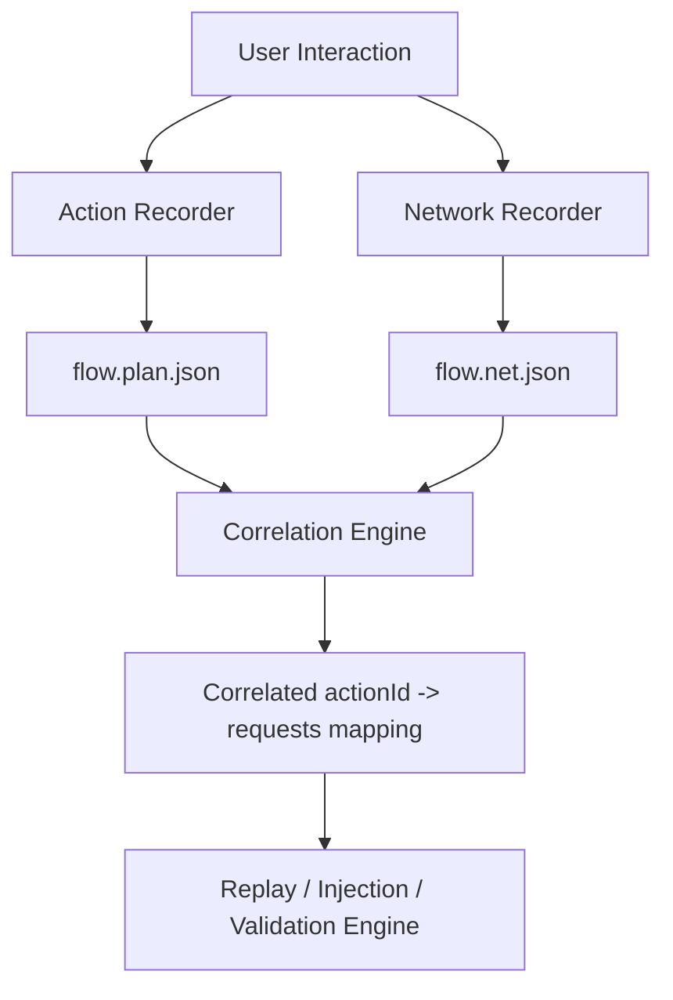
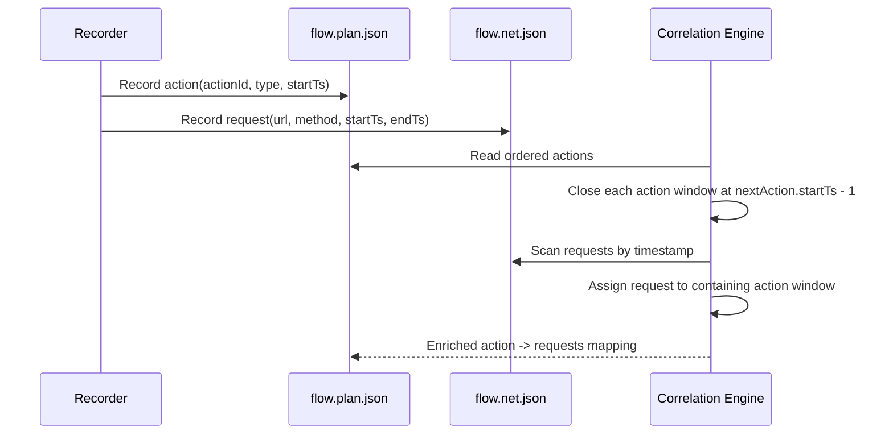

## Module Overview

The **Action to Request Correlation** module links recorded UI actions to the network requests they likely triggered. Its purpose is to produce a reliable `actionId -> requests[]` mapping for downstream replay, payload injection, and exploit validation.

For the MVP, correlation is **timestamp-window based** rather than initiator-stack based. Each recorded action (`click`, `fill`, `select`, `navigation`) opens a time window at `startTs`. When the next action begins, the previous window closes at `nextAction.startTs - 1`. Any request whose timestamp falls inside that window is assigned to that action.

This module operates over two recorder artifacts:

- `flow.plan.json`: ordered UI actions with `actionId`, type, locators, and timestamps
- `flow.net.json`: captured network events with request/response metadata and timestamps

## Architecture

### Component Architecture

- **Action Recorder** captures UI events and emits ordered actions.
- **Network Recorder** captures request/response events with timestamps.
- **Correlation Engine** computes action windows and assigns requests.
- **Execution/Injection Engine** consumes correlated requests for mutation and validation.



### Request Assignment Flow



## Implementation Details

### Technical Approach

Each action has:

- `actionId`
- `type`
- `startTs`
- computed `endTs`

Each request has at minimum:

- `requestId`
- `url`
- `method`
- `startTs`
- optional `endTs`
- optional `reqSignature`

Example correlation logic:

```ts
type Action = {
  actionId: string;
  type: 'click' | 'fill' | 'select' | 'navigation';
  startTs: number;
  endTs?: number;
};

type NetEvent = {
  requestId: string;
  url: string;
  method: string;
  startTs: number;
  endTs?: number;
};

function correlate(actions: Action[], requests: NetEvent[]) {
  const sortedActions = [...actions].sort((a, b) => a.startTs - b.startTs);

  for (let i = 0; i < sortedActions.length; i++) {
    const current = sortedActions[i];
    const next = sortedActions[i + 1];
    current.endTs = next ? next.startTs - 1 : Number.MAX_SAFE_INTEGER;
  }

  return sortedActions.map(action => ({
    ...action,
    requests: requests.filter(
      req => req.startTs >= action.startTs && req.startTs <= (action.endTs ?? Number.MAX_SAFE_INTEGER)
    )
  }));
}
```

### Artifact Example

```json
{
  "actionId": "a-003",
  "type": "click",
  "startTs": 1712345678901,
  "endTs": 1712345679120,
  "requests": [
    {
      "requestId": "r-88",
      "method": "POST",
      "url": "https://app.example.com/api/profile/update",
      "startTs": 1712345679004
    }
  ]
}
```

## Related Decisions

### Decision: Action→request correlation via per-action time windows and timestamps

This module directly implements the decision to use **per-action timestamp windows** for MVP correlation. The rationale was speed, simplicity, and predictable behavior for sequential user flows. It avoids brittle DevTools initiator tracing while still producing the mapping needed by the Playwright-based injection engine.

This also aligns with recorder scope decisions:

- only `click`, `fill`, `select`, and `navigation` are recorded
- final fill values are captured on `blur/change`
- navigation is treated as an explicit action to preserve route-triggered requests

## Key Technical Details

### Algorithms and Data Structures

- Sort actions by `startTs`
- Derive window boundaries:
  - `startTs = action.startTs`
  - `endTs = nextAction.startTs - 1`
- Assign each request by `req.startTs`

Suggested structures:

- `Action[]` sorted array
- `Map<string, NetEvent[]>` keyed by `actionId`
- optional normalized `reqSignature = method + normalizedUrl + bodyHash`

### Integration Points

- **Input**: `flow.plan.json`, `flow.net.json`
- **Output**: enriched actions or separate `action-request-map.json`
- **Consumers**: replay engine, payload injector, exploit validator

### Dependencies

- Shared timestamp source consistency between action and network capture
- Ordered action timeline from recorder
- Network event capture with at least request start time

### Known Limitations

- Background polling may be misattributed
- Long-delayed async requests may fall into later windows
- Highly concurrent SPA behavior may reduce precision

These trade-offs are accepted for MVP and can later be improved with initiator or signature-based heuristics.