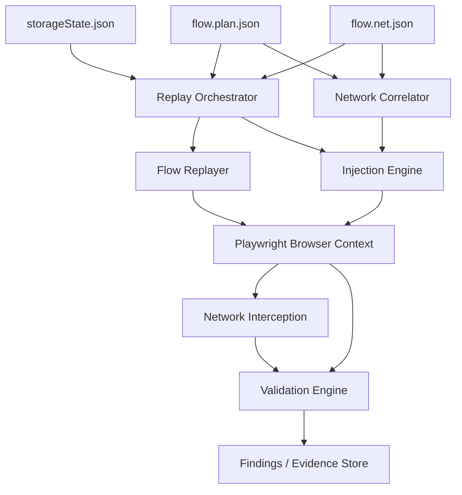
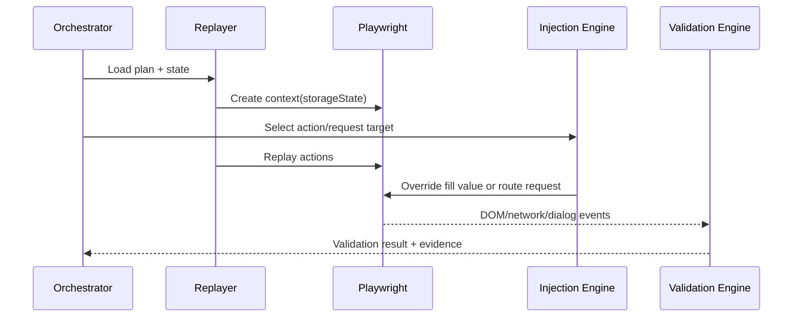

## Module Overview

The **Replay Injection and Validation Engine** executes previously recorded user flows, mutates selected inputs/requests with security payloads, and validates whether those mutations produce observable vulnerability signals. It is the execution-side counterpart to the recorder artifacts:

- `storageState.json` — authenticated browser/session state
- `flow.plan.json` — ordered UI actions (`click`, `fill`, `select`, `navigation`)
- `flow.net.json` — correlated network activity for each action

For the MVP, this module is **deterministic and build-scoped**: given a stable application build and a known recording, it should replay from a known starting point, inject payloads at specific action or request boundaries, and collect browser/network evidence for validation.

## Architecture

### Component Architecture

Key responsibilities are split across a Playwright-based execution pipeline:

- **Replay Orchestrator** loads artifacts and schedules test variants
- **Flow Replayer** executes recorded actions with stable locator fallbacks
- **Injection Engine** mutates UI values and/or intercepted requests
- **Network Correlator** uses action time windows to map requests to actions
- **Validation Engine** inspects DOM, dialogs, navigation, storage, and network side effects
- **Result Writer** stores findings, traces, screenshots, and replay metadata



### Interaction Flow



## Implementation Details

### Technical Approach

The engine should default to **headless Playwright** for scale, with headed mode reserved for debugging and exploit review. Replay reliability depends on:

- stable locators (`data-testid`, role, aria, fallback CSS/text)
- smart waits (`waitForSelector`, `waitForResponse`)
- retry wrappers around flaky steps
- persisted authenticated state via `storageState.json`

The engine supports two injection modes:

- **UI-level injection**: replace a recorded `fill`/`select` value with a payload
- **Request-level injection**: intercept correlated requests and mutate parameters, headers, or body fields

Example Playwright launch configuration:

```javascript
const browser = await chromium.launch({
  headless: true,
  args: ['--disable-blink-features=AutomationControlled']
});
```

Example request interception pattern:

```javascript
await page.route('**/*', async (route, request) => {
  const body = request.postData();
  const mutated = maybeInjectPayload(body, currentActionId);
  await route.continue({ postData: mutated });
});
```

### API Surface

Internal module inputs/outputs are artifact-driven:

| Input | Purpose |
|---|---|
| `storageState.json` | Restore authenticated session |
| `flow.plan.json` | Replay ordered user actions |
| `flow.net.json` | Match expected/correlated requests |
| payload set | Candidate attack strings/rules |

| Output | Purpose |
|---|---|
| finding record | vulnerability signal + severity |
| evidence bundle | screenshot, DOM snapshot, trace, request/response metadata |
| replay log | executed action timeline and failures |

## Related Decisions

- **MVP recorder as headed Playwright emitting three artifacts**: defines the engine’s contract and artifact inputs.
- **Action→request correlation via per-action time windows**: enables targeted request mutation without full initiator tracing.
- **Testing stack: ZAP for breadth + Playwright for depth**: places this module in the high-fidelity validation layer, especially for DOM XSS, auth flows, and business logic cases.
- **Engine-first deterministic MVP**: constrains this module toward repeatable per-build replay, not autonomous exploration.

## Key Technical Details

### Algorithms and Data Structures

- **Action window correlation**:
  - each action has `actionId`, `startTs`, `endTs`
  - previous action closes when next action begins
  - request belongs to action if `reqTs ∈ [startTs, endTs]`
- **Replay model**:
  - ordered action list with frame context and locator fallback chain
- **Request signature**:
  - `method + normalizedUrl + optionalBodyHash`

### Integration Points

- Playwright browser/context APIs
- request routing/interception
- DOM/dialog/navigation listeners
- evidence persistence layer
- optional upstream discovery inputs from ZAP/HAR/OpenAPI

### Dependencies

- **Node.js / TypeScript**
- **Playwright**
- shared JSON schemas for plan/network/state artifacts
- storage for findings, traces, and screenshots