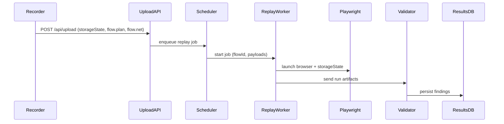

## Module Overview
This module implements the Replay and Injection Engine: a Playwright-driven backend that consumes recorded artifacts (storageState.json, flow.plan.json, flow.net.json), deterministically replays user flows, injects test payloads (XSS/CSRF/parameter tampering), and validates execution via runtime detection (DOM checks, network responses, screenshots, logs).

Scope:
- Deterministic per-build replay (MVP)
- Targeted injection at recorded action points
- Network & DOM-based validation hooks
- Node.js (TypeScript) Playwright workers

## Architecture
- Recorder (headed Playwright or Chrome extension) → uploads artifacts
- Upload/API service stores artifacts and schedules replay jobs
- ReplayWorker (Playwright) loads storageState, replays flow.plan, correlates flow.net events, injects payloads, validates results
- Results DB / Artifact store for run outputs

```mermaid
graph TD
  A[Recorder (Playwright/Extension)] -->|upload artifacts| B[Upload API (/api/upload)]
  B --> C[Artifact Storage (S3/DB)]
  B --> D[Scheduler]
  D --> E[ReplayWorker (Playwright)]
  E --> F[Validator / Detector]
  F --> G[Results DB / UI]
```

Sequence (API):


## Implementation Details

### Data model (examples)
- flow.plan.json (action timeline)
```json
{
  "actions": [
    { "actionId":"a1","type":"fill","startTs":1650000000000,"locator":["data-testid=login"],"value":"<USER_INPUT>" },
    { "actionId":"a2","type":"click","startTs":1650000001000,"locator":["css=.submit"] }
  ]
}
```
- flow.net.json (HAR++ minimal)
```json
{ "requests":[{"id":"r1","startTs":1650000000500,"method":"POST","url":"/login","postData":"...","status":200}]}
```

### Time-window correlation (action → request)
Assign each request to the action whose [startTs, endTs] contains request.startTs. Close previous action window when next action starts.
```javascript
function correlate(actions, requests){
  actions.sort((a,b)=>a.startTs-b.startTs);
  for(let i=0;i<actions.length;i++){
    actions[i].endTs = (i+1<actions.length) ? actions[i+1].startTs-1 : Infinity;
  }
  return requests.map(r=>({
    req: r,
    actionId: actions.find(a=>r.startTs>=a.startTs && r.startTs<=a.endTs)?.actionId || null
  }));
}
```

### Replay & Injection (Playwright example)
- Load storageState.json for auth
- For each action in flow.plan:
  - If action.type === "fill": substitute value with payload and fill()
  - If click: click()
- Intercept network to mutate requests where needed
```javascript
await context.addCookies(...); // or use storageState
await page.route('**/*', async route => {
  const req = route.request();
  if (shouldInject(req)) {
    const newPost = injectPayload(req.postData());
    await route.continue({ postData: newPost });
  } else await route.continue();
});
```

## API (minimal)
- POST /api/upload (multipart: storageState.json, flow.plan.json, flow.net.json) → 201 {flowId}
- POST /api/replay (body: { flowId, payloads[], runOptions }) → 202 {jobId}
- GET /api/replay/{jobId}/status → 200 {status, findings, artifacts[]}

## Related Decisions
- Testing stack: ZAP for breadth + Playwright for depth (decision_key: 26efd8cc-...) — Playwright chosen for exploit validation.
- Backend language: Node.js/TypeScript (decision_key: 81837702-...) — aligns with Playwright.
- MVP scope: deterministic per-build replay, engine-first (decision_key: d48dde17-...) — focuses this module.

## Key Technical Details
- Algorithms: timestamp time-window correlation (fast, deterministic)
- Data structures: compact HAR++ (truncated bodies, reqSignature), flow.plan action timeline with multiple locators
- Integrations: Playwright (workers), S3/DB for artifacts, optional ZAP for pre-discovery
- Dependencies: Node.js, Playwright, storage (S3), job queue (Bull/Redis)

This module is designed for repeatable, high-fidelity replay and precise injection points while keeping the MVP scope focused on deterministic engine behavior rather than automation/UI.