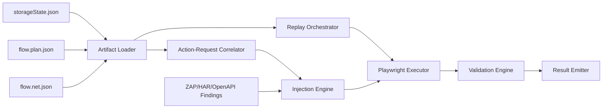
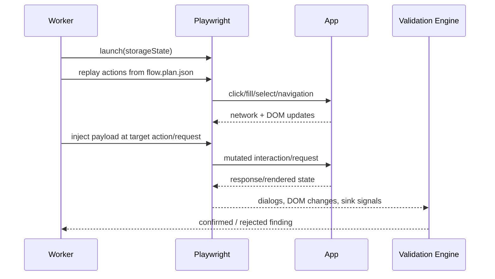

## Module Overview

The **Replay Injection and Validation Engine** is the execution core of the MVP security-testing pipeline. It consumes recorder artifacts—`storageState.json`, `flow.plan.json`, and `flow.net.json`—to deterministically replay authenticated browser flows, inject payloads at selected action or request boundaries, and validate whether a vulnerability actually executes in a real browser.

Its scope is intentionally narrow for MVP:
- Deterministic **per-build** replay
- Payload injection into recorded UI and correlated network requests
- Real-browser validation for issues such as DOM XSS and business-logic abuse
- Integration with broader discovery tooling such as ZAP/HAR/OpenAPI

This module is not responsible for broad endpoint discovery or AI-driven exploration.

## Architecture

### Component Architecture

Key runtime components:
- **Artifact Loader**: loads and validates `storageState`, action plan, and network log
- **Replay Orchestrator**: replays recorded actions in order
- **Action→Request Correlator**: maps requests to actions using timestamp windows
- **Injection Engine**: mutates fill/select values and optionally request parameters/headers/body
- **Playwright Executor**: runs the browser session and performs real interactions
- **Validation Engine**: detects exploit execution via DOM, dialogs, network, or sink instrumentation
- **Result Emitter**: stores findings, traces, screenshots, and replay metadata



### Interaction Flow



## Implementation Details

### Technical Approach

Replay uses recorded actions only: `click`, `fill`, `select`, and `navigation`. For each action:
- restore frame context and preferred locator
- execute with Playwright auto-waiting
- optionally replace the recorded value with a payload
- observe resulting requests and browser state

Request attribution follows the MVP time-window model:
- each action has `actionId` and `startTs`
- previous action closes when next action starts
- requests with timestamps inside the window are attached to that `actionId`

### Example Execution Configuration

```javascript
const browser = await chromium.launch({
  headless: true,
  args: ['--disable-blink-features=AutomationControlled']
});

const context = await browser.newContext({
  storageState: 'storageState.json'
});
```

### Injection Example

```javascript
for (const action of flow.actions) {
  if (action.type === 'fill' && action.actionId === targetActionId) {
    await page.locator(action.locators.primary).fill(payload);
  } else {
    await replayAction(page, action);
  }
}
```

### Validation Signals

Typical validation hooks:
- intercepted `dialog` events (`alert`, `prompt`, `confirm`)
- DOM mutation checks for payload reflection/execution
- instrumented sink monitoring (`eval`, `innerHTML`, custom markers)
- response/body differences and follow-up requests

## Related Decisions

- **Testing stack: ZAP for breadth + Playwright for depth**: this engine is the Playwright-based depth/validation layer.
- **Node.js/TypeScript aligned with Playwright**: enables shared schemas and worker execution.
- **MVP recorder emits three artifacts**: defines this module’s input contract.
- **Recorder v0 action coverage**: constrains replay to click/fill/select/navigation.
- **Time-window action→request correlation**: powers targeted request mutation.
- **Deterministic per-build MVP scope**: explains why replay is optimized for stability, not autonomous exploration.

## Key Technical Details

### Algorithms and Data Structures

Core structures:
- `FlowAction`: `{ actionId, type, startTs, endTs, locators, framePath, value }`
- `NetEvent`: `{ requestId, ts, method, url, headers, postData, status, contentType }`
- `ReqSignature`: normalized `method + url + optional bodyHash`

Correlation algorithm:
1. sort actions by `startTs`
2. set `endTs = next.startTs - 1`
3. assign each request to the action window containing `req.ts`

### Integration Points

- **Recorder output**: direct JSON artifact ingestion
- **Playwright workers**: headed for debugging, headless for CI
- **ZAP findings**: seed high-risk endpoints or parameters for mutation
- **Reporting pipeline**: emit confirmed findings with evidence

### Dependencies

- `playwright`
- Node.js/TypeScript runtime
- shared JSON schema validation library
- optional hashing/normalization utilities for request signatures