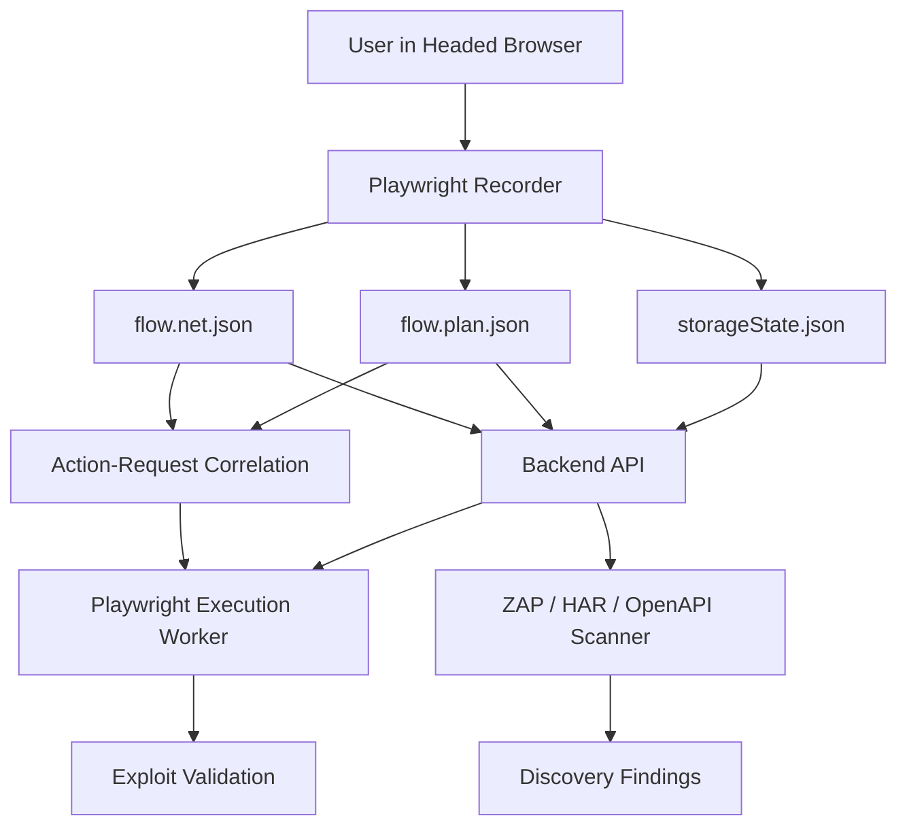

## Module Overview

This module defines how the security engine integrates **Playwright** and **ZAP** into a single scanning pipeline. Its purpose is to combine:

- **ZAP/HAR/OpenAPI** for breadth: endpoint discovery, proxy-style scanning, and cheap parameter fuzzing
- **Playwright** for depth: authenticated flows, SPA behavior, DOM-based exploit validation, and business-logic testing

The scope includes recording flows, replaying them deterministically per build, correlating UI actions to network traffic, exporting artifacts, and orchestrating downstream scans. It does **not** attempt autonomous AI exploration in the MVP.

## Architecture

### Component Architecture

The MVP uses a recorder-first, engine-first design:

- **Headed Playwright Recorder**
  - Captures login-first user flows
  - Emits `storageState.json`, `flow.plan.json`, and `flow.net.json`
- **Artifact Uploader / Backend API**
  - Stores artifacts and scan metadata
- **Execution Worker (Node.js/TypeScript + Playwright)**
  - Replays recorded flows
  - Injects payloads into recorded attack points
  - Validates exploit execution in a real browser
- **ZAP Scanner**
  - Consumes HAR/OpenAPI-derived inputs for broad coverage
- **Correlation Layer**
  - Maps requests to actions using timestamp windows



## Implementation Details

### Technical Approach

Recorder v0 captures only the minimum security-relevant action set:

- `click`
- `fill` (final value on `blur`/`change`)
- `select`
- `navigation`

This reduces noise while preserving replay and injection fidelity. Multiple locator strategies should be stored per action:

- preferred: `data-testid`, ARIA role/name
- fallback: CSS selector
- optional: visible text

### Artifact Contract

| Artifact | Purpose |
|----------|---------|
| `storageState.json` | Auth/session state for deterministic replay |
| `flow.plan.json` | Ordered UI actions, selectors, frame context, values |
| `flow.net.json` | HAR++-style network log with timestamps and request metadata |

### Correlation Algorithm

Requests are assigned to actions using per-action time windows:

```ts
type ActionWindow = {
  actionId: string;
  startTs: number;
  endTs?: number;
};

function correlateRequest(reqTs: number, windows: ActionWindow[]) {
  return windows.find(w => reqTs >= w.startTs && reqTs <= (w.endTs ?? Infinity));
}
```

When action `N+1` starts, action `N` is closed with:

```ts
previous.endTs = next.startTs - 1;
```

This produces a usable `actionId -> requests[]` mapping for payload injection and replay analysis.

### Playwright Runtime Example

```js
const browser = await chromium.launch({
  headless: true,
  args: ['--disable-blink-features=AutomationControlled']
});
```

Use headed mode for recording/debugging; use headless by default for execution workers.

## Related Decisions

- **Testing stack: ZAP for breadth + Playwright for depth and exploit validation**  
  This module directly implements that split: ZAP for scalable discovery, Playwright for browser-executed validation.

- **MVP recorder: headed Playwright (Node.js) emitting storageState + flow plan + network log**  
  The three-artifact contract is the foundation of this integration layer.

- **Recorder v0 captures only click/fill/select/navigation**  
  Keeps the scanner focused on security-relevant events while avoiding excessive noise.

- **Action→request correlation via per-action time windows and timestamps**  
  Enables practical request attribution without DevTools initiator complexity.

- **Backend/agent language: Node.js (TypeScript) aligned with Playwright**  
  Simplifies shared schemas and worker implementation.

## Key Technical Details

### Algorithms and Data Structures

- Ordered action timeline with `actionId`, timestamps, locators, and frame context
- HAR++ network entries with method, URL, headers, optional body hash, status, and timestamps
- Time-window correlation for `actionId -> request[]`

### Integration Points

- Recorder uploads artifacts to backend
- Backend fans out to:
  - Playwright replay/injection workers
  - ZAP discovery/active scan jobs
- Validation results can be merged with ZAP findings to distinguish:
  - potential issues
  - browser-confirmed exploits

### Dependencies

- `playwright`
- Node.js / TypeScript runtime
- ZAP automation or API integration
- Optional HAR/OpenAPI import pipeline

This architecture gives the MVP a practical hybrid model: **cheap breadth from ZAP, high-fidelity exploit confirmation from Playwright**.