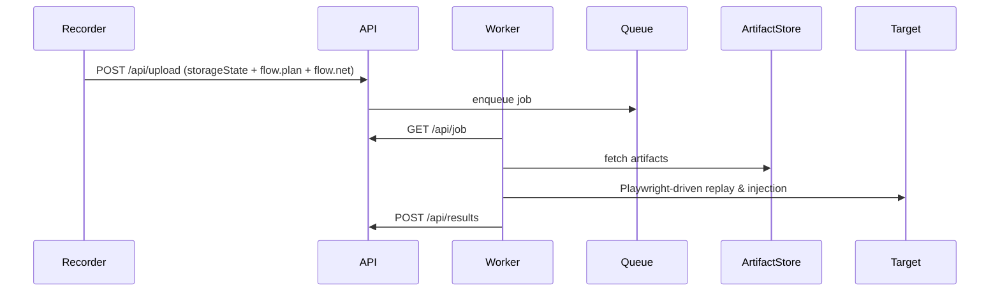

## Module Overview
This module documents the Platform Architecture and Scaling for the Playwright-driven record → replay → inject → validate pipeline. It describes component responsibilities, interactions, scaling model, artifact contract, and key algorithms used in the MVP.

## Architecture
### Component architecture (high-level)
- Recorder (headed Playwright Node.js): produces storageState.json, flow.plan.json, flow.net.json
- Optional Browser Extension (recorder UX / network capture)
- Backend API / Orchestrator (Node.js/TypeScript)
- Worker pool (Playwright workers for deterministic replay & injection)
- Scanning tools (ZAP for breadth) and result store / reporting

```mermaid
graph TD
  U[User / Tester]
  U --> R[Recorder (Headed Playwright)]
  R -->|uploads| API[Backend API / Orchestrator]
  API --> Store[Artifact Store]
  API --> Queue[Replay Job Queue]
  Queue --> W[Playwright Worker Pool]
  W -->|replay+inject| Target[Target App]
  W --> Results[Detection & Report Store]
  ZAP[ZAP Scanner] --> API
```

### Sequence (upload → replay)


## Implementation Details
### Artifact contracts (summary)
- storageState.json: Playwright storageState (cookies/localStorage/session)
- flow.plan.json: action timeline
  - actionId, type (click|fill|select|navigation), startTs, locatorCandidates[], value (for fills), frameId
- flow.net.json (HAR++ minimal): requestId, startTs, method, url, headers, postData (truncated/optional), response status, endTs, contentType, reqSignature

### Example: time-window request→action correlation (JS)
```javascript
// actions sorted by startTs
function correlateRequests(actions, requests) {
  // compute endTs: next.startTs - 1 or Infinity for last
  for (let i = 0; i < actions.length; i++) {
    actions[i].endTs = (actions[i+1]?.startTs ?? Infinity) - 1;
  }
  requests.forEach(req => {
    const action = actions.find(a => req.startTs >= a.startTs && req.startTs <= a.endTs);
    req.actionId = action?.actionId ?? null;
  });
  return requests;
}
```

### Recorder example (Playwright headed)
```javascript
const { chromium } = require('playwright');
(async () => {
  const browser = await chromium.launch({ headless: false });
  const context = await browser.newContext();
  const page = await context.newPage();
  // attach event listeners to capture actions and network (page.on('request'))
  // persist storageState, flow.plan.json, flow.net.json
})();
```

### Backend API (minimal)
- POST /api/upload
  - body: { storageState, flowPlan, flowNet, metadata }
  - returns jobId
- POST /api/replay (admin)
  - body: { jobId, injectionProfile }
- GET /api/job
  - worker polls for jobs
- POST /api/results
  - body: { jobId, reports, artifacts }

## Related Decisions
- MVP recorder: headed Playwright (Node.js) emitting storageState + flow plan + network log (decision_key: 56cecc55-...)
- Backend language: Node.js/TypeScript aligned with Playwright (decision_key: 81837702-...)
- Time-window action→request correlation (decision_key: 131b1ee5-...)
- Testing stack: ZAP for breadth + Playwright for depth (decision_key: 26efd8cc-...)
- MVP scope: deterministic per-build replay, engine-first, no AI (decision_key: d48dde17-...)

Rationale: recorded artifacts and simple correlation enable deterministic, repeatable injection and validation in real browsers with a Playwright worker pool while keeping MVP scope small.

## Key Technical Details
- Algorithm: time-window correlation for request→action mapping; fallbacks: initiator/stack-trace heuristics later.
- Scaling: stateless worker pool, job queue (Redis/RabbitMQ), artifact store (S3), and autoscaling Playwright workers with resource isolation (container per worker).
- Dependencies: Playwright (Node), Node.js/TypeScript backend, optional chrome debugging/webRequest for extension capture, ZAP for discovery.
- Security: storageState contains sensitive tokens — encrypt at rest and limit retention by policy.

This module is intentionally engine-first and tuned for predictable replayability and scalable Playwright execution.