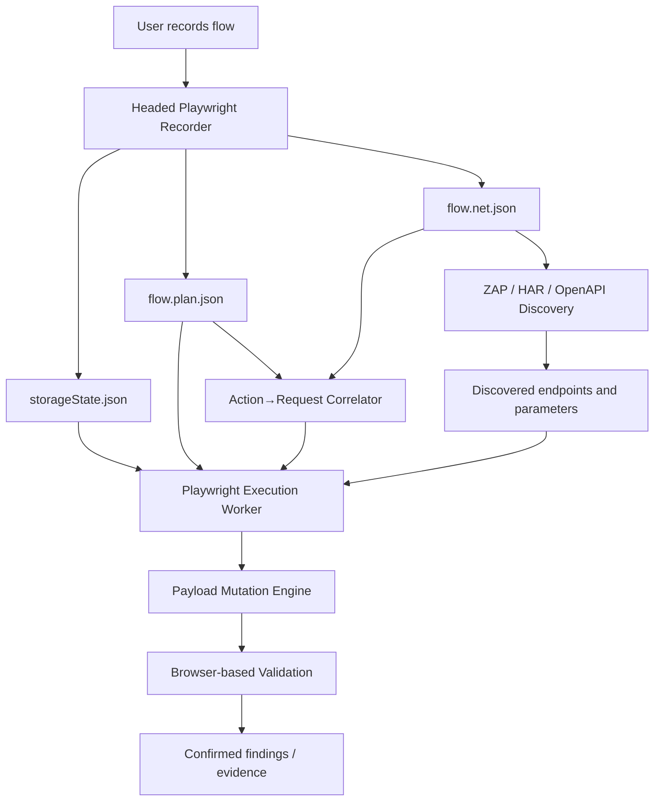

## Module Overview

This module defines how the MVP security engine combines **ZAP for discovery breadth** with **Playwright for high-fidelity replay, payload injection, and exploit validation**. Its scope covers recording authenticated user flows, correlating UI actions to network traffic, feeding broad scans into proxy-based tooling, and selectively escalating targets into browser-based validation.

The goal is not to replace existing scanners. Instead, the system uses:
- **ZAP/HAR/OpenAPI inputs** for endpoint discovery, passive analysis, and broad fuzzing
- **Playwright** for authenticated flows, SPA behavior, DOM/JS execution, and exploit confirmation
- A shared artifact contract:
  - `storageState.json`
  - `flow.plan.json`
  - `flow.net.json`

## Architecture

### Component Architecture

The scanning stack is intentionally hybrid:

- **Recorder** captures user actions and session state in a headed Playwright browser
- **Correlation layer** maps requests to actions using timestamp windows
- **Discovery layer** uses HAR/OpenAPI/ZAP for breadth
- **Execution layer** replays flows in Playwright workers with payload mutations
- **Validation layer** confirms exploit behavior in a real browser



### Key Interactions

- Recorder emits the three artifacts consumed downstream.
- Correlator assigns requests to `actionId` based on per-action `startTs/endTs`.
- ZAP provides cheap coverage across endpoints and parameters.
- Playwright workers replay only targeted flows where real-browser execution matters.

## Implementation Details

### Technical Approach

For MVP, replay is **deterministic per build**. The recorder captures only:
- `click`
- `fill`
- `select`
- `navigation`

For `fill`, only the **final value on blur/change** is stored, reducing noise and privacy exposure.

### Action→Request Correlation

Each action opens a time window:
- `startTs = action timestamp`
- `endTs = nextAction.startTs - 1`
- request belongs to the action whose window contains `reqTs`

```javascript
function correlateRequests(actions, requests) {
  for (let i = 0; i < actions.length; i++) {
    actions[i].endTs = i < actions.length - 1
      ? actions[i + 1].startTs - 1
      : Number.MAX_SAFE_INTEGER;
  }

  return requests.map((req) => {
    const action = actions.find(a => req.ts >= a.startTs && req.ts <= a.endTs);
    return { ...req, actionId: action?.actionId ?? null };
  });
}
```

### Example Artifact Shape

```json
{
  "actionId": "a-12",
  "type": "fill",
  "startTs": 1710001234567,
  "locator": {
    "primary": "[data-testid='email']",
    "fallback": "input[name='email']"
  },
  "value": "user@example.com",
  "frame": "main"
}
```

### API/Worker Contract

| Input | Producer | Consumer |
|---|---|---|
| `storageState.json` | Recorder | Playwright worker |
| `flow.plan.json` | Recorder | Replay/injection engine |
| `flow.net.json` | Recorder | Correlator, discovery, validation |

## Related Decisions

- **ZAP for breadth + Playwright for depth**: selected because proxy-based tools alone cannot reliably validate DOM XSS or complex SPA/auth workflows.
- **Recorder outputs three artifacts**: keeps the interface minimal and aligned with the execution engine.
- **Time-window correlation**: chosen for implementation speed and deterministic mapping in MVP.
- **Recorder v0 action coverage**: limited to `click/fill/select/navigation` to maximize replay stability and reduce noise.
- **Engine-first deterministic MVP**: avoids AI/UI complexity until replay, injection, and validation are proven.

## Key Technical Details

### Algorithms and Data Structures

- **Action timeline**: ordered array of actions with `actionId`, `type`, `startTs`, `endTs`
- **Network log**: HAR++-style records with request/response metadata and timestamps
- **Correlation output**: `actionId -> requests[]`

### Integration Points

- **ZAP inputs**: HAR, OpenAPI, discovered endpoints
- **Playwright hooks**:
  - session restore via `storageState`
  - action replay from `flow.plan.json`
  - payload substitution at fill/select/query/header points
  - browser-side validation of JS execution and DOM effects

### Dependencies

- Node.js / TypeScript
- Playwright
- ZAP
- Shared JSON schemas for recorder and workers

This design balances **scan breadth**, **execution fidelity**, and **MVP simplicity** while leaving room for later enhancements such as smarter attribution, AI-assisted mutation, and UI-driven workflow management.