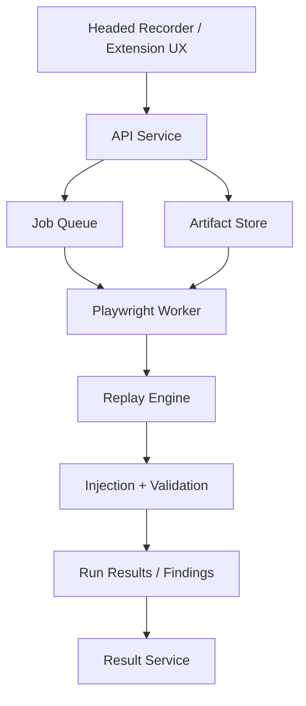
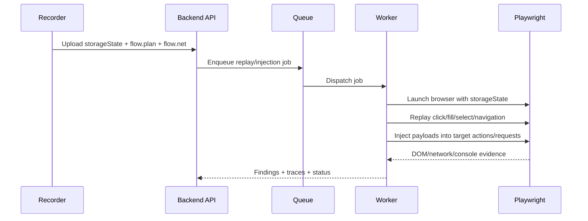

## Module Overview

The backend worker platform executes the MVP security engine: it accepts recorded flow artifacts, replays them deterministically in Playwright, injects payloads at selected action/request points, and validates outcomes. This module covers the Node.js/TypeScript service layer, job orchestration, Playwright worker runtime, and artifact contract used between recorder and backend.

Scope includes:

- Artifact ingestion for `storageState.json`, `flow.plan.json`, and `flow.net.json`
- Job creation and queueing for replay/injection runs
- Deterministic browser execution in isolated workers
- Action→request correlation consumption for targeted mutation
- Result capture for findings, traces, and validation evidence

This module explicitly aligns with the engine-first MVP: no AI planning layer, no full UI requirement, and Playwright as the execution authority.

## Architecture

### Component architecture

- **API service**: receives uploaded artifacts and creates execution jobs
- **Job queue**: dispatches replay/injection tasks to workers
- **Worker runtime**: launches Playwright, restores `storageState`, replays recorded actions, injects payloads, and captures evidence
- **Artifact store**: persists uploaded flow artifacts and run outputs
- **Result service**: normalizes findings and execution logs for downstream reporting



### Key interactions



## Implementation Details

### Technical approach

Use Node.js with TypeScript to share schemas between recorder and execution services. Workers consume the three MVP artifacts:

- `storageState.json`: authenticated browser context
- `flow.plan.json`: ordered actions (`click`, `fill`, `select`, `navigation`) with locators and metadata
- `flow.net.json`: HAR++-style request/response log correlated by action window

A representative artifact shape:

```ts
type FlowAction = {
  actionId: string;
  type: 'click' | 'fill' | 'select' | 'navigation';
  startTs: number;
  endTs?: number;
  url?: string;
  value?: string;
  locators: { primary?: string; fallback?: string[] };
};
```

Replay logic should preserve order and deterministic timing, while allowing mutation of selected fields or requests:

```ts
for (const action of flow.actions) {
  switch (action.type) {
    case 'fill':
      await page.locator(action.locators.primary!).fill(action.value ?? '');
      break;
    case 'click':
      await page.locator(action.locators.primary!).click();
      break;
    case 'select':
      await page.locator(action.locators.primary!).selectOption(action.value!);
      break;
    case 'navigation':
      await page.goto(action.url!);
      break;
  }
}
```

### API surface

Suggested backend endpoints:

| Endpoint | Method | Purpose |
|----------|--------|---------|
| `/api/runs` | `POST` | Create run from uploaded artifacts |
| `/api/runs/:id` | `GET` | Fetch run status |
| `/api/runs/:id/results` | `GET` | Fetch findings/evidence |
| `/api/artifacts/:id` | `GET` | Retrieve stored artifact metadata |

## Related Decisions

- **Headed Playwright recorder emitting three artifacts**: defines the backend input contract and keeps recorder/worker aligned.
- **Node.js/TypeScript backend**: enables direct Playwright integration and shared types.
- **Time-window action→request correlation**: allows workers to identify which requests belong to which UI action for mutation and validation.
- **ZAP + Playwright testing stack**: positions this module as the high-fidelity execution layer, especially for browser-validated issues like DOM XSS.
- **Engine-first MVP**: justifies a service/worker architecture before building a full UI.

## Key Technical Details

### Algorithms and data handling

- **Action/request mapping**: workers consume `actionId`, `startTs`, and `endTs` windows to target requests associated with a given UI step.
- **Locator resilience**: use primary plus fallback selectors from recorded actions.
- **Isolation**: run each job in a separate browser context/container to reduce cross-run contamination.
- **Evidence capture**: store console logs, network diffs, DOM assertions, screenshots, and request/response summaries.

### Dependencies and integrations

- `playwright` for browser automation
- Queue system such as BullMQ/SQS-compatible worker abstraction
- Object storage for artifacts and evidence
- Optional ZAP integration for breadth-first discovery inputs to complement worker validation

This module is the operational core of deterministic replay, payload injection, and exploit confirmation.