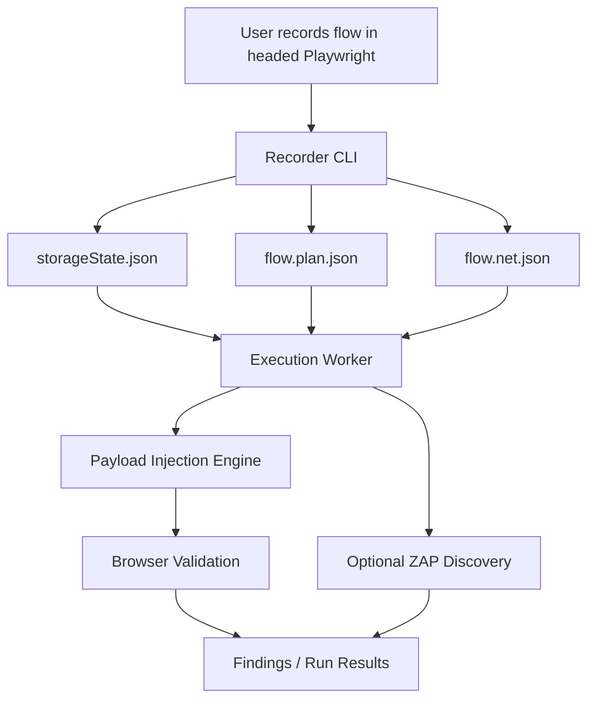

## Module Overview

This module defines the **delivery boundary for the MVP**: prove the core engine can **record, replay, inject, and validate** deterministic user flows on a per-build basis. The MVP is intentionally **engine-first**, with no AI-driven intelligence layer, no polished end-user UI, and no Git-based script maintenance automation.

The scope is constrained to the smallest set of capabilities needed to validate technical feasibility and security value:

- Record authenticated flows starting from login
- Persist replay artifacts
- Deterministically replay flows in Playwright
- Inject payloads into recorded input points
- Validate exploit outcomes in a real browser
- Run broad discovery with ZAP where useful

Out of scope for MVP:

- AI-generated payloads or autonomous exploration
- Full self-serve web UI
- Automatic Git-aware flow regeneration
- General-purpose script healing across arbitrary app changes
- Large-scale orchestration and optimization beyond basic worker execution

## Architecture

### Component Architecture

The MVP uses a **record once, replay per build** model. A headed Playwright recorder captures the minimal artifact contract, and backend workers consume those artifacts for deterministic security execution.



### Key Interactions

- **Recorder CLI** captures:
  - authenticated session state
  - action timeline
  - correlated network activity
- **Execution Worker** replays actions from a known start state
- **Injection Engine** mutates targeted fields/requests
- **Validation Layer** confirms real exploit behavior, especially browser-executed issues such as DOM XSS

## Implementation Details

### Technical Approach

The MVP recorder is a **headed Playwright Node.js/TypeScript tool** producing exactly three artifacts:

| Artifact | Purpose |
|----------|---------|
| `storageState.json` | Auth/session replay state |
| `flow.plan.json` | Recorded actions, locators, values, timestamps |
| `flow.net.json` | Network log correlated to actions |

Recorder v0 only captures:

- `click`
- `fill`
- `select`
- `navigation`

For `fill`, only the **final value on blur/change** is stored to reduce noise and avoid keystroke-level logging.

### Example Artifact Shape

```json
{
  "actionId": "a-12",
  "type": "fill",
  "locator": {
    "primary": { "type": "testId", "value": "search-input" },
    "fallbacks": [
      { "type": "css", "value": "input[name='q']" }
    ]
  },
  "value": "hello",
  "startTs": 1712345678901
}
```

### Correlation Model

Requests are mapped to UI actions using **timestamp windows**:

```ts
type ActionWindow = {
  actionId: string;
  startTs: number;
  endTs?: number;
};

function assignRequest(ts: number, windows: ActionWindow[]) {
  return windows.find(w => ts >= w.startTs && ts <= (w.endTs ?? Infinity))?.actionId;
}
```

When a new action starts, the previous action window closes at `nextAction.startTs - 1`.

## Related Decisions

### MVP Scope Decision

This module directly follows the decision to keep the MVP:

- deterministic
- engine-first
- per-build
- without AI
- without full UI
- without Git automation

That decision exists to reduce delivery risk and prove the hardest part first: **reliable authenticated replay plus exploit validation**.

### Supporting Design Decisions

Additional decisions shaping this module:

- **Recorder outputs three artifacts** compatible with downstream Playwright execution
- **Action coverage is limited** to click/fill/select/navigation for MVP
- **Action→request correlation** uses simple time windows
- **ZAP + Playwright** are both used, with Playwright required for high-fidelity validation

## Key Technical Details

### Algorithms and Data Structures

- **Action windows** for request correlation
- **Multi-locator storage** for replay resilience
- **Minimal HAR++-style network log** with request/response metadata
- **Per-build deterministic replay** using recorded session state and action order

### Integration Points

- Playwright for recording and replay
- ZAP for breadth-oriented discovery
- Artifact upload/storage service
- Result reporting pipeline

### Dependencies

- Node.js / TypeScript
- Playwright
- ZAP
- JSON artifact schemas shared between recorder and execution worker

The core boundary is deliberate: the MVP is successful when it can repeatedly replay known flows and validate injected security behavior with high fidelity.